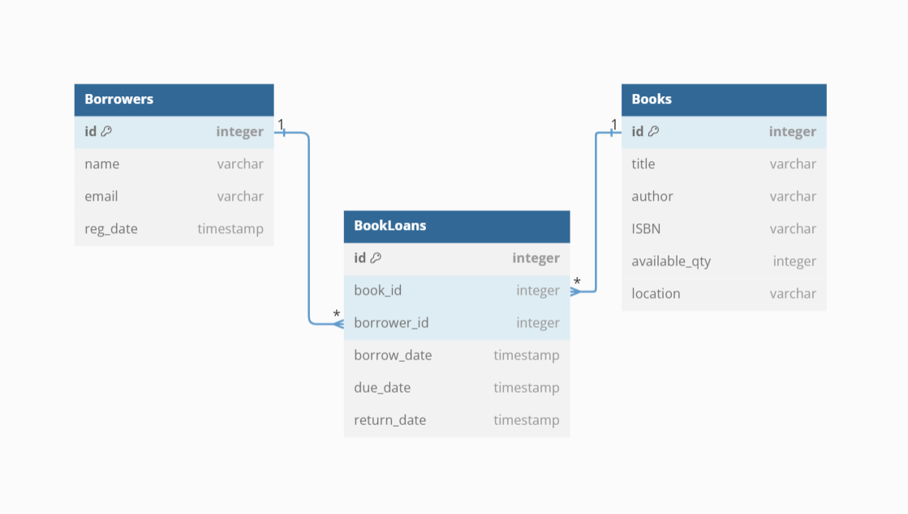

# Library Management System

This is a **Node.js** and **Express** based backend project for a **Library Management System**. The application uses **MySQL** as the database and includes **Swagger** documentation for the RESTful API.

The system supports management of:

- Books
- Borrowers
- Borrowing and returning books
  Additionally, access logs are saved for all incoming API requests.

The app is **containerized using Docker**, with a **Docker Compose** file for orchestrating both the application and the MySQL database.  
A test server has been deployed on **Azure**, and the Swagger API documentation is available at:  
[http://172.161.88.247:5000/api-docs/](http://172.161.88.247:5000/api-docs/)

---

## ER Diagram



## Features

### Endpoints Overview

| **Resource** | **Endpoint** | **Description**                  |
| ------------ | ------------ | -------------------------------- |
| Books        | `/books`     | CRUD operations for books        |
| Borrowers    | `/borrowers` | CRUD operations for borrowers    |
| Book Loans   | `/bookLoans` | Manage borrowing/returning books |

### Access Logs

- Every incoming API request is logged to maintain request history for auditing.

---

## Project Structure

```plaintext
/library-management
│
├── controllers/        # Contains route controllers (business logic)
├── models/             # Database models for MySQL
├── routes/             # API route definitions
├── middleware/         # Request logging middleware
├── config/             # Database configuration and Custom Logger setup
├── Dockerfile          # Docker image configuration
├── docker-compose.yml  # Docker Compose for app + MySQL
├── package.json        # Project dependencies and scripts
├── README.md           # Project documentation
├── .env                # Environment variables
├── install.sh          # Script to install docker dependencies on test server
└── wait-for-it.sh      # Script to wait for MySQL container to be ready
```

## Getting Started

### Installation

1. Clone the repository:

```bash
git clone https://github.com/markyasser/LibraryManagementSystem.git
cd LibraryManagementSystem
```

2. Install the dependencies:

```bash
npm install
```

3. Create a `.env` file in the root directory and add the following environment variables:

```plaintext
# Port number
PORT=5000
HOST=localhost (or server ip)
DB_HOST=localhost (or db in case of Docker)
DB_USER=root
DB_PASSWORD=root
DB_NAME=library
DB_PORT=3306
```

4. Start the application:

```bash
npm start
```

The app should now be running on [http://localhost:5000](http://localhost:5000).

### Docker

1. install Docker and Docker Compose on your machine.

```bash
./install.sh
```

2. Start the application using Docker Compose:

```bash
docker-compose up --build -d
```
